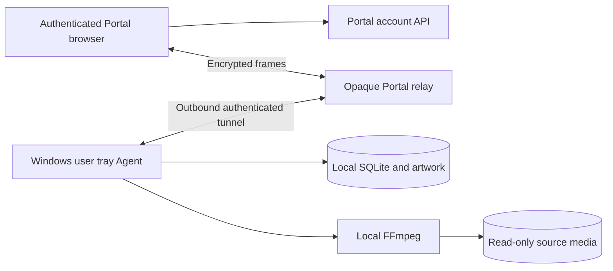
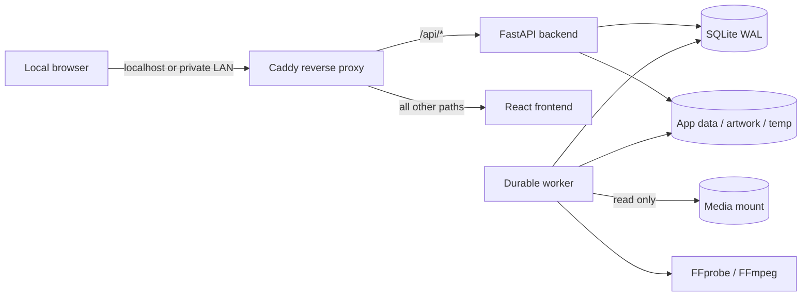

# Blue Ash Reel architecture

Verified against source and the live development environment on September 13,
2026 (America/Denver; Remote Streaming verification). This is a map:
verify repository state and runtime evidence before architectural or deployment work.

This updates the existing Agent `docs/architecture.md`; the Portal guide is a pointer here.

## Ownership and repositories

Codex owns the Agent, main Portal/Web, supporting APIs, local configuration and
development deployment. Claude owns the TV app. **Do not modify the TV app.**
Shared API, authentication, transport, discovery, library and playback changes
require compatibility review and a TV handoff.

The Portal repository is `NRichard-lab/BlueAshReelPortal`, locally at
`C:/Users/dog10/OneDrive/Documents/ChatGPT/BlueAshReel`. The Agent checkout is
`C:/Users/dog10/OneDrive/Documents/ChatGPT/BlueReel/BlueAshReel`.
Both current development branches are `codex/remote-streaming-settings`, descended
from the deployed Libraries and Blue Home work. Do not substitute `origin/main`
for the deployed branch without reconciling its ancestry and component pins.

## System and data ownership

The React/Vite Portal is served by nginx behind Caddy. FastAPI account API,
broker, encrypted relay and optional mail worker use PostgreSQL 17. Accounts,
MFA/session security, invitations, authorization, Agent registration, pairing
and device challenge state live centrally. The Portal server does not own a
media catalog, filesystem browser, FFmpeg workload or media storage.

The Windows Agent runs a tray supervisor, API and separate worker under the
signed-in user. It owns SQLite, libraries, approved paths, media records,
technical streams, metadata/manual matches, artwork, watch history, playback
work, private identity and settings. Its outbound connections reach the Portal.
The browser exchanges encrypted operations with the Agent through the relay.
Opaque remote object IDs replace local database IDs and paths in browser URLs.
Folder labels are intentionally sanitized; the native folder chooser confirms
locations on the workstation. Do not move browsing into the Portal server.

## Current development deployment — critical

**CURRENT ACTIVE SERVER:** `blue-reel-web01`, LAN `192.168.50.107`, SSH user
`blueashreel`, Ubuntu 26.04.1 LTS, Hyper-V. Docker Engine 29.8.0 / Compose v5.5.1
were recorded during the migration. Hostname/OS, running services and checkout
were independently checked over authenticated SSH during this task.

Portal checkout: `/srv/blueashreel-portal`. Compose project:
`blueashreel-portal`; services: frontend, api, broker, relay, mailer, db.
The five configured health checks are healthy; mailer is running without its
own configured health check. Shared Caddy and unrelated application projects
must not be recreated or pruned. Only frontend joins the shared edge network.
Database ports remain unpublished and networks remain isolated.

**OLD SERVER: `docker-vm` / historical `DockerVm`, `192.168.50.227`.**
**DO NOT DEPLOY BLUE ASH REEL HERE.** The September 12 migration report records
its application containers stopped and data retained for rollback. Its SSH port
timed out in this session; current container state there was not reverified.
The `docker-vm` SSH alias and historical sections of Portal `docs/deployment.md` still
reference it. They are not evidence of the current destination. The sibling
`BlueAshReelMove/MIGRATION_FINAL_REPORT.md` records the migration, but is also
historical evidence to cross-check rather than blindly trust.

Before deployment verify explicit IP, SSH host identity, `hostname`, OS,
`docker ps`, checkout status/HEAD, and running image revision. Print current
and retired targets and both source SHAs immediately before activation. Stop
when evidence conflicts. Do not infer the target from an alias, old env file,
Docker context or old README.

For frontend-only development: transfer and verify a Git bundle when needed,
fast-forward a clean checkout to the reviewed commit, then run
`bash scripts/deploy-component.sh frontend`. It builds a `git archive` of HEAD,
labels/pins that exact revision, updates only `PORTAL_FRONTEND_IMAGE_TAG`, uses
`--no-deps --no-build` for activation, checks image/health and restores the prior
pin on health failure. Keep `.env.production`, its mail overlay, secret mounts,
other component pins, account database and downloads intact. A frontend restart
interrupts existing browser relay circuits: reconnect and verify playback after
the final activation. Never use a full-stack deployment for a frontend-only edit.

Current frontend source: `78fbd520d7ba37b702a272a6788f68675f028e7c`.
API/broker/relay/mailer remain on `b4e11665e38cd6b440f984f45621acdf3e4a5fce`. Documentation
commits after this SHA do not imply a new running frontend image.

## Native Agent environment and updates

Program: `C:/Users/dog10/AppData/Local/Programs/BlueAshReel-Development`.
State: `C:/Users/dog10/AppData/Local/BlueAshReel-Development`.
`configuration/installation.json` declares schema 2, `runtime_mode=per_user`,
loopback binding and stable storage paths. Effective native API readiness is
`http://127.0.0.1:18080/api/v1/health/ready` (do not assume the legacy API port).
`configuration/.env` and protected identity files must never be printed or committed.
SQLite is `database/app.db`; configuration, artwork, logs, temp, backups and
remote identity have distinct directories. `state/tray-status.json`, native
heartbeats and `remote-control/status.json` expose operational status.

Use the existing `scripts/dev_program_update.py` for explicit Python source-file
replacement with compile checks, immutable source backup, clean tray pause/start
callbacks, startup/reconnection/playback validation and automatic program rollback.
Online SQLite backup is additional protection, never a reason to restore older
mutable data during an ordinary program update. Tray maintenance commands bind to
the current runtime ID/PID and expire; use `pause`/`restart`, never unpair/reset.

The historical Libraries deployment used Agent source `b5b47260c132b6703ce1898806d4a539a77e1938`,
plus dependency declaration `8392dde35d682fd86c17ef75caf19cb9ae29e36f`.
Windows needs IANA zone data: `tzdata==2026.3` is now declared and hash-pinned.
The existing packaged runtime lacked it. Its 627 package files were added to
the existing runtime and verified against the pinned wheel. No installer was
built. The durable local deployment receipt is
`state/libraries-settings-deployment.json`; it records exact source-file hashes,
backup paths and the dependency. Product identity remains `0.1.0-development.6`.

## Agent settings

`application_settings` is the existing local SQLite key/value table; do not
create a parallel settings database or central Portal preference copy.
General uses `general.settings`, schema 1. Windows startup reads/writes the
existing per-user Run registration rather than treating SQLite as authoritative.
`services/general_settings.py` validates identity, locale, IANA timezone and
startup/connection behavior. General changes are dynamic, with no restart needed.

Libraries uses `libraries.settings`, schema 1, implemented in
`services/library_settings.py`. Owner-only encrypted RPC operations
`settings.libraries.get` and `settings.libraries.update` return the full validated
model. Updates accept partial `scan_policy` and `scan_analysis` objects; nested
schedule updates merge omitted fields. Unknown groups, malformed values and
unsupported true capabilities fail validation before commit. Persistence failure
is not reported as success. No SQLite DDL migration was necessary.

Defaults preserve pre-existing behavior: automatic scanning off, schedule off
(`03:00`, Monday retained as inert configuration), watcher off, permanent cleanup
off, audio/subtitle analysis on, preview/chapter generation off. Merely reading
does not persist defaults or start work. Existing extension/ignored-directory
preferences remain under their original scanner keys.

Portal `viewer/settings/settings-ui.tsx` owns the existing Save/Discard context.
General and Libraries maintain independent Agent-loaded baselines; only changed
groups are sent. Partial success updates the successful baseline; failed groups
retain edits. Duplicate saves are guarded synchronously. Periodic connection
refreshes do not overwrite active edits. Unsupported or unloaded Libraries
controls do not display frontend placeholders as real Agent configuration.
Save applies policy for future coordinator ticks and new analysis work; no
restart is requested. Analysis is captured at scan start, not changed mid-probe.

## Remote Streaming policy and Settings relocation

September 13, 2026 verified deployment: Agent source overlay
`afeefd0d3f2def36a273be04ea5a5f2f04ae6f98` and Portal frontend
`78fbd520d7ba37b702a272a6788f68675f028e7c` are active in development. Receipt
`state/remote-streaming-deployment.json` records the six exact source hashes,
immutable program backup and online SQLite snapshot. Pairing/configuration,
original watch rows and catalog counts passed preservation checks. The tray's
installation source_revision remains its baseline; the source receipt identifies
this overlay. Live Save/refresh/Discard, reconnect, movie/TV browsing and resumed
Direct Play passed. Original remote defaults were restored after verification.
See Portal `docs/REMOTE_STREAMING_COMPLETION_REPORT.md` for exact evidence.

Portal Settings now displays Remote
Streaming while retaining `remote-access` hashes/component identifiers. Connection
status is extracted intact into a single System card after the existing Agent
summary; other System placeholders/actions remain unimplemented and unchanged.
The companion Portal `docs/ARCHITECTURE.md` documents the UI and full contract.

Agent `services/remote_streaming.py` owns schema 1 in existing
`application_settings`, key `remote_streaming.settings`. Owner-only encrypted RPC
`settings.remote_streaming.get/update` reads/partially updates strict `enabled`,
`max_quality`, `bitrate_limit_bps` and `session_limit`. Defaults are enabled,
original/no additional quality cap, null/no additional bitrate cap, and the
existing overall session ceiling (bounded 1–100). Explicit bitrate is integer
1,000,000–50,000,000 bps; sessions are integer 1–100. Reads do not write. Atomic
SQLite updates validate and commit; Web's existing Save/Discard has an independent
remote baseline and retains failed edits. No DDL migration/restart is required.

`RemoteMedia.principal` sets an internal `remote_playback` flag for relay operations;
clients cannot assert locality. All current Windows media RPC uses relay, including
LAN browsers. Native loopback authorization provides status, not a LAN playback
listener. The retained container HTTP API remains a local-network ingress and keeps
its local classification. No forwarded-header or request-payload trust was added.
Any future direct-media ingress needs its own trusted locality contract.

Disabled remote streaming rejects decisions, new admission and further remote
media/state/progress reads with `remote_streaming_disabled` (403 internally).
Stop, catalog, settings, pairing and Portal connectivity remain available. Buffered
media may finish; unchanged inactivity cleanup reaps abandoned processes. Local
playback is unaffected. The existing admission `BEGIN IMMEDIATE` expires stale
sessions then atomically counts active `decision.remote_playback=true` rows across
users. Full quota returns `remote_session_limit` (429 internally), preserving active
streams. Existing total/per-user limits and inactivity timeout (default 90s, range
30–600s) still apply. Startup expires old unmarked active rows as it already did.

Compatibility `decide` accepts an internal optional remote policy, composing ceilings
with existing transcoding policy/capabilities. Resolution never upscales. Missing
height with explicit quality ceiling fails pending rescan. Known sources below
limits keep Direct Play/remux; unknown/excess aggregate bitrate under an explicit
cap requires the current converter. Forced-remux/direct-only/4K restrictions still
reject unsupported conversions. Policy is snapshotted in existing decision JSON;
no parallel playback system or client request schema was introduced.

The bitrate control is a per-stream media encoding budget. Conversion subtracts
5% mux allowance and 160 kbps AAC from decimal bps, then caps existing video
`-b:v`/`-maxrate`/`-bufsize`; audio uses the existing 160 kbps AAC path when video
converts under an explicit cap. Source estimates, VBR peaks and actual mux overhead
mean this is not an instantaneous wire-rate guarantee; UI and Portal docs state
that limitation. Original/null preserve the existing global transcoding behavior.

TV contracts remain additive; old request shapes, authentication and opaque IDs
are unchanged. TV sources are untouched. Optional error-message support is described
in Portal `docs/CLAUDE_REMOTE_STREAMING_HANDOFF.md`. Deferred: native direct playback
locality, exact wire-rate shaping, richer probe/peak measurements, complete client
negotiation, codec matrices, hardware profiles and dynamic encoder discovery.

## Libraries and safety

Models: `Library`, `LibraryPath`, `MediaItem`, `MediaFile` in Agent `app/models.py`.
Existing encrypted `libraries.list/create/update/delete/scan/stop/status/errors`
use local Owner authorization. The list is paginated (Portal pages of 24);
aggregate queries return real media/file/error counts without fetching the whole
catalog. Cards display enabled state, active scan, enabled folder count and last
successful scan. TV media counts include series records, so 15 TV items is not
the same as 15 video files.

Manage Folders retains name/type, stages removal checkboxes and selected folders,
then saves or cancels. The native Agent confirms added locations. Duplicate,
unapproved, missing and inaccessible paths follow existing path validation.
Combined folder edits validate before mutation and commit together. Removing a
folder disables its path and marks associated files unavailable; records remain.
Temporarily inaccessible roots do not trigger destructive missing-file cleanup.

Disabling a library retains configuration, media, metadata and watch history,
while stopping future automatic scanning/watching. Existing behavior marks its
files unavailable. **After re-enabling, Scan Changes restores availability**;
enabling alone does not re-probe files. Configuration changes are rejected while
a scan lock is active. The UI disables incompatible actions during active scans.

Remove Library requires an explicit browser confirmation explaining that indexed
records, associated metadata and history are removed. SQL cascades remove local
index records. **No code deletes source media files.** Account, keys and pairing
are unaffected. Test removal only against disposable libraries.

## Scanner and media analysis

`services/jobs.py` owns persistent `BackgroundJob`, `ScanJob`, events, leases,
retries and per-library `ScanLock` uniqueness. A single normal worker claims jobs
atomically. Interrupted work is requeued and stale leases recovered. Manual,
scheduled and watcher work all call the same `enqueue_scan` and `run_scan`.
Scans yield to active conversion playback before job claim. FFprobe is bounded
by timeout and scans commit batches; there is no unbounded per-file subprocess fanout.

Changed scans enumerate approved paths and reuse relative-path/size/mtime
fingerprints, skipping unnecessary probes. Renames generally appear as a new
path plus a missing old entry; this is not a content-hash rename tracker. Full
rescans refresh existing indexing/naming and sidecars without deleting/recreating
identities or manual metadata decisions. They do not blindly re-probe every
unchanged file. Existing identification and metadata regression coverage remains.

Only complete readable traversal marks unseen files unavailable and records
`missing_since`; incomplete/offline traversal cannot trigger permanent deletion.
There is no supported permanent trash purge. Scan status exposes actual queue
state, processed files, known final total, timestamps and safe errors. No fake
percentages are generated. Library lists refresh every 10 seconds; an opened
scan-status panel refreshes every 5 seconds while the page is visible.

FFprobe remains a single probe per analyzed file. Audio captures codec, language,
channels, layout and bitrate; subtitle capture includes embedded codec/language,
forced and hearing-impaired flags. Disabling a category suppresses new/replacement
stream rows and retains existing rows. Toggling does not regenerate the catalog;
unchanged files keep the existing probe-skip behavior. Previously stored technical
rows can consequently remain stale while that category is disabled.
No scrub-preview or chapter-thumbnail generator exists; both settings remain
explicitly unavailable/false. Poster/backdrop/sidecar artwork is a separate system.

## Automatic scanning

`services/automatic_scanning.py` runs one daemon coordinator beside the worker.
It checks locally persisted preferences, enabled libraries and approved roots,
then feeds incremental work into the existing queue. The master switch gates
scheduling and watching while retaining their configuration. Automatic scans
check policy at safe cancellation points; manual scans remain independent.

Daily/weekly schedules use the General IANA timezone and structured frequency,
HH:MM time and weekday (Monday=0). A local-date slot in
`scanner.schedule.<library_id>` is committed with the queued job. Missed earlier
times on the current eligible day run when the Agent next checks; historical
days are not replayed. A repeated DST hour does not duplicate a slot; skipped
times run after the gap. Changing the configured schedule can create a new slot.

`watchfiles` (already supplied by uvicorn standard) uses filesystem notifications,
with no forced polling. It groups events (5-second maximum batch, 1-second quiet
step); affected libraries retain one pending request until 30 seconds of quiet.
An existing scan lock retains pending work for a later incremental scan. Disabling
the master/watcher or a library removes it from future automatic consideration.
Native watcher failures retry after 30 seconds with sanitized logs. Filesystems
without reliable native notifications may require scheduled/manual scanning;
no special network-share watcher guarantee is made. The library root inventory
is revalidated on coordinator ticks; large root counts may warrant future caching.

## Connections and TV compatibility

### Blue Home profile integration

Verified development source overlay: `a348ae759dfebd14b6b93dca8eaef3797e21415c`,
paired with Portal `b4e11665e38cd6b440f984f45621acdf3e4a5fce` on current server
`blue-reel-web01` / `192.168.50.107` (2026-09-13 UTC). Source-only update receipt:
`state/blue-home-deployment.json` beneath the Development data root. The tray's
installation-baseline source_revision is not rewritten by source overlays.
Migration `300100000001`, pairing/configuration preservation, owner resume mapping
and live Direct Play were verified. Additive migration and backup schema registry
remain available on a runtime-source rollback; mutable data is never overwritten
by this source update. Full evidence is in the Portal completion report.

The central household domain is documented in the companion Portal's
`docs/ARCHITECTURE.md` (Blue Home identity foundation) and
`docs/CLAUDE_BLUE_HOME_HANDOFF.md`. It is separate from account authentication,
Agent ownership and local library permissions. Do not merge the separate Blue Ash
launch portal and Reel account databases by email; no federation currently exists.

The Agent trusts an additive `blue_home` claim only from existing authenticated
Portal authorization validation. Migration `300100000001` adds `blue_home_state`:
stable profile/home/owner-account IDs map to a local viewing-state subject. Owner
profiles reuse existing local owner IDs; new profiles use non-login state subjects
without roles or library grants. No existing watch rows are copied/reset. The
backup schema registry recognizes both the old schema and this additive migration.

`Principal.user` remains the authenticated account for authorization and stream
quotas; `Principal.watch_user_id` is used only for viewing state and preferences.
Playback decisions freeze `viewing_user_id`; catalog/history/resume and progress
writes use it. Watch-state identity does not confer library access. Linked external
accounts need existing Portal membership and explicit local library grants, even
when they share a viewing identity with a locally selected profile. New profiles
do not see the owner's watch history. Names, PINs and custom avatar bytes remain
central, not in Agent state. Disabled/unlinked profiles retain their history.

Profile switches expire prior Portal media authorizations, causing existing relay
revocation to retire circuits. Cleanup filters the old viewing identity; another
profile's new playback is preserved. Missing claims retain legacy account state;
trusted owner claims map losslessly to the original owner's state. The encrypted
status operation advertises `blue_home_profiles: true`. The TV app has not been
modified; consumers must implement the documented selection/PIN/reconnect flow.

Pairing uses permanent Agent identity and protected private keys. Signed service
authentication is independent from interactive MFA. General friendly-name
projection is capability-negotiated. Portal inventory/status checks, outbound
Agent reconnect policy and bounded encrypted circuit queues remain unchanged.
See Portal `docs/backend-control-plane.md`, `docs/deployment.md` and Agent remote modules
for authentication, broker routing, relay lifetime and local transport details.

Libraries RPC additions are optional Owner administration operations. Existing
catalog, media IDs, authorization, transport and playback payload shapes were not
changed. Claude does not need a TV release for this work. If TV adds these settings,
handle unsupported operations from older Agents and preserve missing-track cases
when an Owner disables new audio/subtitle analysis. Native TV playback itself was
not exercised by this task; browser movie playback and TV browsing were verified.

## Development workflow and invariants

Inspect repo/runtime -> reconcile source of truth -> implement narrowly -> run
backend/frontend tests, lint, type checks and production build -> explicitly verify
and print deployment target -> deploy development source -> verify live -> update
this guide. Use isolated test databases ending `_test`, never the account database.
Native synthetic media tests require the existing FFmpeg/FFprobe paths.

Development changes do not mean a version bump, tag, release or installer rebuild.
Those are separate deliberate tasks. Never reinstall, reset SQLite, regenerate
install identity, re-pair, delete media/history or deploy to the retired host as
a shortcut. Preserve manual identification, stable media IDs and locally owned
settings. Do not write secrets into architecture or handoff documents.

Functional inventory: real library management and counts; incremental/full scans;
persistent status/queue; Save/Discard; automatic master, daily/weekly scheduler,
debounced change detection; audio/subtitle preferences; unchanged local playback,
pairing, encrypted catalog and metadata flows. Intentional gaps: thumbnail
generators, permanent trash purge, reliable rename matching, watcher diagnostics
in the UI, automatic file availability restoration on Enable, and applying new
analysis preferences retroactively to unchanged files. See
the companion Portal `docs/LIBRARIES_IMPLEMENTATION_REPORT.md` for exact acceptance results and limits.

## Retained Docker and subsystem reference

The following existing reference remains for the separate local Docker/legacy
deployment and established subsystem details. It is not a deployment target for
the active Windows Agent/public Portal environment verified above. Historical
validation observations retain their original scope and must be rechecked before
using the legacy deployment. The current environment sections above take precedence.

# Architecture overview

The Windows product uses the public Portal as its interface and a per-user tray
Agent for local media work. Accounts/MFA/invitations/coarse memberships live in
Portal PostgreSQL; libraries/catalog/artwork/progress/local grants live in Agent
SQLite. Browser-to-Agent frames remain encrypted through the public relay.

See [encrypted authorization/media](encrypted-portal-agent.md) and
[current acceptance](portal-tray-acceptance.md). The local website and household
accounts below remain a separate Docker/legacy deployment.

## Preserved Docker architecture

Blue Ash Reel keeps HTTP work, background media inspection, source media, and mutable application state separated. The Docker topology is:

Backend, worker and frontend use only the Compose `private` network, marked
`internal`. On the validated Docker 29.7 engine, an internal-only namespace did not
provide the required published host port.
Therefore the proxy joins `private` and a dedicated ingress bridge and
publishes the loopback port. Its startup guard installs
default-deny IPv4/IPv6 OUTPUT and FORWARD rules, then permits only established TCP
replies, localhost:8080 health checks, backend:8000 and frontend:3000. Runtime DNS
is blocked after the two internal service names are resolved during initialization.

Only proxy initialization has NET_ADMIN plus the capabilities needed to drop its
identity. Before starting either Tini or Caddy it drops to UID 1000 with zero
capabilities, including its bounding set. The health check verifies actual process
privileges as well as HTTP. Firewall setup failure exits before Caddy listens.
Port publication, the firewall and Caddy share one lifecycle, avoiding split
namespaces or stale readiness after Docker restarts. The guard never receives
host networking, a Docker socket, privileged mode or access to host firewall rules.
A trusted Docker administrator can still create privileged exec processes; this
is not a sandbox against a host/Docker administrator.

Caddy routes versioned API and OpenAPI requests to FastAPI and interface requests
to the frontend. Automatic HTTPS remains disabled for this local HTTP phase.

## Components and responsibilities

| Component | Responsibility | Persistent access |
| --- | --- | --- |
| Caddy | Local reverse proxy, response compression, basic security headers | None |
| Frontend | Setup, household browsing/player, profile/history and administration | None |
| FastAPI backend | Authentication, assigned-library authorization, catalog, range/HLS delivery, playback management | SQLite, app data, artwork, temp, read-only media |
| Worker | Restart-safe jobs, media discovery, FFprobe analysis, local artwork | SQLite, app data, artwork, temp, read-only media |
| SQLite | Normalized state, audit events, durable job queue; WAL mode | `DATABASE_PATH/app.db` |

The API process applies Alembic migrations before accepting traffic. The worker waits for backend readiness before starting, so migrations are serialized through the backend startup path. Jobs live in SQLite rather than process memory; stale running jobs can be recovered after interruption.

## Data boundaries

The container paths are stable even when host directories change:

| Container path | Purpose | Access |
| --- | --- | --- |
| `/database` | SQLite database and WAL files | Read/write by backend and worker |
| `/data` | Application-controlled persistent files | Read/write |
| `/artwork` | Local artwork/cache | Read/write |
| `/tmp/app` | Disposable analysis/transcode workspace | Read/write |
| `/media` | Primary operator-approved source root | Read-only |
| `/media-roots/<id>` | Additional operator-approved source roots | Read-only |
| `/app/config/product.json` | Central product identity | Read-only |

Library paths must resolve beneath an approved media root. Normal clients submit
HMAC-signed root-relative selections, not paths. The backend rejects traversal,
absolute host paths, symlinks/reparse points, and similar-prefix escapes, then
revalidates canonical containment before storing or scanning. The authenticated
folder browser lists directories only and never exposes a drive to frontend or
proxy containers. Scanner code treats source media as immutable and stores
availability/history in the database.

## Scale and performance posture

Potentially large collections are handled with paginated APIs, indexed database lookups, batched scan commits, size/mtime fingerprints, and FFprobe only for changed files. Scan work never runs in an HTTP request. This phase runs one worker service deliberately, providing a conservative concurrency ceiling while SQLite is the database. Library-level overlap protection prevents two scans of the same library.

SQLite WAL permits readers while the worker writes. A future database adapter can replace SQLite without changing media UUID identity or external metadata identifiers. The queue service is likewise isolated behind job operations so a later queue can be introduced without changing API contracts.

## Trust model

- Owner, Administrator and Viewer roles are active. All viewers, including Owners, need explicit library assignments. Management permissions do not bypass playback authorization.
- Browser authentication uses server-managed, HTTP-only cookies; no long-lived credential belongs in browser local storage.
- Only the reverse proxy publishes a port.
- Runtime egress is blocked at the Docker network layer, and integration permission is separately denied by configuration and database settings.
- Structured logs redact sensitive keys and values. Caddy access logging is not enabled.
- Container logs use three 10 MiB local files per service.

The decision rationale is recorded in [ADR 0001](adr/0001-local-first-foundation.md).

After rebuilding/recreating either upstream, use `docker compose up --detach --build`
for the complete project so the proxy refreshes its address allowlist.
For a controlled restart use `docker compose restart` for the whole project.
An isolated upstream recreation can leave old addresses unavailable; it must never
be repaired by granting unrestricted DNS or Internet access.

## Phase 2 data and process flow

Migration `2a0100000001` adds library grants, preferences, watch progress, video
compatibility fields and trigger-maintained FTS5. `2b0100000001` adds indexed
playback sessions. Both upgrade a populated Phase 1 database without modifying
original rows; downgrade discards only the new Phase 2 records/columns.

Catalog queries page media and choose one preferred file per card with a window
query. Home rails are independently bounded; details page file variants ten at a
time. Search intersects indexed FTS results with assigned enabled libraries.
Discovery rejects files containing more than 128 streams to bound track metadata.

A short SQLite write transaction admits playback and orders checkpoints. No
FFmpeg startup wait holds that writer lock. One API process owns a local conversion
manager (enforced by a storage lock), separate from the durable scan worker. New
background scans yield while converted playback is active. FFmpeg executes in
bounded child processes supervised through private pipes; EOF after API failure
triggers termination and reaping before the output ownership lock is released.
Startup expires old playback sessions but keeps durable resume points.

The reverse proxy never exposes a media directory. Every direct, HLS and subtitle
request passes authenticated authorization; only generated segment basenames are
accepted. No media URL grants access by possession alone. See [conversion](transcoding.md).
