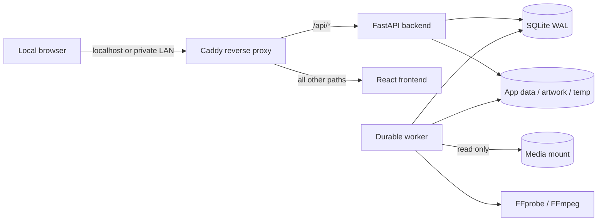

# Architecture overview

Blue Ash Reel keeps HTTP work, background media inspection, source media, and mutable application state separated. The Docker topology is:

Backend, worker and frontend use only the Compose `private` network, marked
`internal`. On the validated Docker 29.7 engine, an internal-only namespace did not
provide the required published host port.
Therefore the proxy joins `private` and a dedicated ingress bridge and
publishes the loopback port. Its startup guard installs
default-deny IPv4/IPv6 OUTPUT and FORWARD rules, then permits only established TCP
replies, localhost:8080 health checks, backend:8000 and frontend:3000. Runtime DNS
is blocked after the two internal service names are resolved during initialization.

Only proxy initialization has NET_ADMIN plus the capabilities needed to drop its
identity. Before starting either Tini or Caddy it drops to UID 1000 with zero
capabilities, including its bounding set. The health check verifies actual process
privileges as well as HTTP. Firewall setup failure exits before Caddy listens.
Port publication, the firewall and Caddy share one lifecycle, avoiding split
namespaces or stale readiness after Docker restarts. The guard never receives
host networking, a Docker socket, privileged mode or access to host firewall rules.
A trusted Docker administrator can still create privileged exec processes; this
is not a sandbox against a host/Docker administrator.

Caddy routes versioned API and OpenAPI requests to FastAPI and interface requests
to the frontend. Automatic HTTPS remains disabled for this local HTTP phase.

## Components and responsibilities

| Component | Responsibility | Persistent access |
| --- | --- | --- |
| Caddy | Local reverse proxy, response compression, basic security headers | None |
| Frontend | Setup, household browsing/player, profile/history and administration | None |
| FastAPI backend | Authentication, assigned-library authorization, catalog, range/HLS delivery, playback management | SQLite, app data, artwork, temp, read-only media |
| Worker | Restart-safe jobs, media discovery, FFprobe analysis, local artwork | SQLite, app data, artwork, temp, read-only media |
| SQLite | Normalized state, audit events, durable job queue; WAL mode | `DATABASE_PATH/app.db` |

The API process applies Alembic migrations before accepting traffic. The worker waits for backend readiness before starting, so migrations are serialized through the backend startup path. Jobs live in SQLite rather than process memory; stale running jobs can be recovered after interruption.

## Data boundaries

The container paths are stable even when host directories change:

| Container path | Purpose | Access |
| --- | --- | --- |
| `/database` | SQLite database and WAL files | Read/write by backend and worker |
| `/data` | Application-controlled persistent files | Read/write |
| `/artwork` | Local artwork/cache | Read/write |
| `/tmp/app` | Disposable analysis/transcode workspace | Read/write |
| `/media` | Primary operator-approved source root | Read-only |
| `/media-roots/<id>` | Additional operator-approved source roots | Read-only |
| `/app/config/product.json` | Central product identity | Read-only |

Library paths must resolve beneath an approved media root. Normal clients submit
HMAC-signed root-relative selections, not paths. The backend rejects traversal,
absolute host paths, symlinks/reparse points, and similar-prefix escapes, then
revalidates canonical containment before storing or scanning. The authenticated
folder browser lists directories only and never exposes a drive to frontend or
proxy containers. Scanner code treats source media as immutable and stores
availability/history in the database.

## Scale and performance posture

Potentially large collections are handled with paginated APIs, indexed database lookups, batched scan commits, size/mtime fingerprints, and FFprobe only for changed files. Scan work never runs in an HTTP request. This phase runs one worker service deliberately, providing a conservative concurrency ceiling while SQLite is the database. Library-level overlap protection prevents two scans of the same library.

SQLite WAL permits readers while the worker writes. A future database adapter can replace SQLite without changing media UUID identity or external metadata identifiers. The queue service is likewise isolated behind job operations so a later queue can be introduced without changing API contracts.

## Trust model

- Owner, Administrator and Viewer roles are active. All viewers, including Owners, need explicit library assignments. Management permissions do not bypass playback authorization.
- Browser authentication uses server-managed, HTTP-only cookies; no long-lived credential belongs in browser local storage.
- Only the reverse proxy publishes a port.
- Runtime egress is blocked at the Docker network layer, and integration permission is separately denied by configuration and database settings.
- Structured logs redact sensitive keys and values. Caddy access logging is not enabled.
- Container logs use three 10 MiB local files per service.

The decision rationale is recorded in [ADR 0001](adr/0001-local-first-foundation.md).

After rebuilding/recreating either upstream, use `docker compose up --detach --build`
for the complete project so the proxy refreshes its address allowlist.
For a controlled restart use `docker compose restart` for the whole project.
An isolated upstream recreation can leave old addresses unavailable; it must never
be repaired by granting unrestricted DNS or Internet access.

## Phase 2 data and process flow

Migration `2a0100000001` adds library grants, preferences, watch progress, video
compatibility fields and trigger-maintained FTS5. `2b0100000001` adds indexed
playback sessions. Both upgrade a populated Phase 1 database without modifying
original rows; downgrade discards only the new Phase 2 records/columns.

Catalog queries page media and choose one preferred file per card with a window
query. Home rails are independently bounded; details page file variants ten at a
time. Search intersects indexed FTS results with assigned enabled libraries.
Discovery rejects files containing more than 128 streams to bound track metadata.

A short SQLite write transaction admits playback and orders checkpoints. No
FFmpeg startup wait holds that writer lock. One API process owns a local conversion
manager (enforced by a storage lock), separate from the durable scan worker. New
background scans yield while converted playback is active. FFmpeg executes in
bounded child processes supervised through private pipes; EOF after API failure
triggers termination and reaping before the output ownership lock is released.
Startup expires old playback sessions but keeps durable resume points.

The reverse proxy never exposes a media directory. Every direct, HLS and subtitle
request passes authenticated authorization; only generated segment basenames are
accepted. No media URL grants access by possession alone. See [conversion](transcoding.md).
