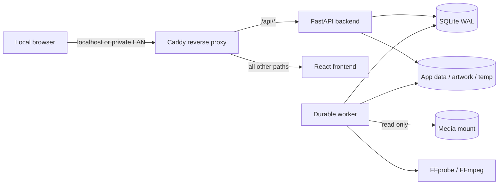

# Architecture overview

BlueReel keeps HTTP work, background media inspection, source media, and mutable application state separated. The Docker topology is:

All four runtime containers use the Compose `private` network, which is marked `internal`. Only Caddy publishes a host port. Caddy routes versioned API and OpenAPI requests to FastAPI and routes interface requests to the frontend. It does not enable automatic HTTPS because this phase binds locally and does not manage household certificates.

## Components and responsibilities

| Component | Responsibility | Persistent access |
| --- | --- | --- |
| Caddy | Local reverse proxy, response compression, basic security headers | None |
| Frontend | First-run setup and administration interface | None |
| FastAPI backend | Authentication, authorization, versioned REST API, settings, health | SQLite, app data, artwork |
| Worker | Restart-safe jobs, media discovery, FFprobe analysis, local artwork | SQLite, app data, artwork, temp, read-only media |
| SQLite | Normalized state, audit events, durable job queue; WAL mode | `DATABASE_PATH/app.db` |

The API process applies Alembic migrations before accepting traffic. The worker waits for backend readiness before starting, so migrations are serialized through the backend startup path. Jobs live in SQLite rather than process memory; stale running jobs can be recovered after interruption.

## Data boundaries

The container paths are stable even when host directories change:

| Container path | Purpose | Access |
| --- | --- | --- |
| `/database` | SQLite database and WAL files | Read/write by backend and worker |
| `/data` | Application-controlled persistent files | Read/write |
| `/artwork` | Local artwork/cache | Read/write |
| `/tmp/app` | Disposable analysis/transcode workspace | Read/write |
| `/media` | Operator-selected source media root | Read-only |
| `/app/config/product.json` | Central product identity | Read-only |

Library paths submitted to the API must resolve beneath an allowed media root. The UI never offers unauthenticated filesystem browsing. Scanner code treats source media as immutable and stores availability/history in the database.

## Scale and performance posture

Potentially large collections are handled with paginated APIs, indexed database lookups, batched scan commits, size/mtime fingerprints, and FFprobe only for changed files. Scan work never runs in an HTTP request. This phase runs one worker service deliberately, providing a conservative concurrency ceiling while SQLite is the database. Library-level overlap protection prevents two scans of the same library.

SQLite WAL permits readers while the worker writes. A future database adapter can replace SQLite without changing media UUID identity or external metadata identifiers. The queue service is likewise isolated behind job operations so a later queue can be introduced without changing API contracts.

## Trust model

- The Owner is the first and only provisioned role in this phase; role and authorization tables preserve future Administrator and Viewer support.
- Browser authentication uses server-managed, HTTP-only cookies; no long-lived credential belongs in browser local storage.
- The reverse proxy is the only published service.
- Runtime egress is blocked at the Docker network layer, and integration permission is separately denied by configuration and database settings.
- Structured logs redact sensitive keys and values. Caddy access logging is not enabled.
- Container logs use three 10 MiB local files per service.

The decision rationale is recorded in [ADR 0001](adr/0001-local-first-foundation.md).
